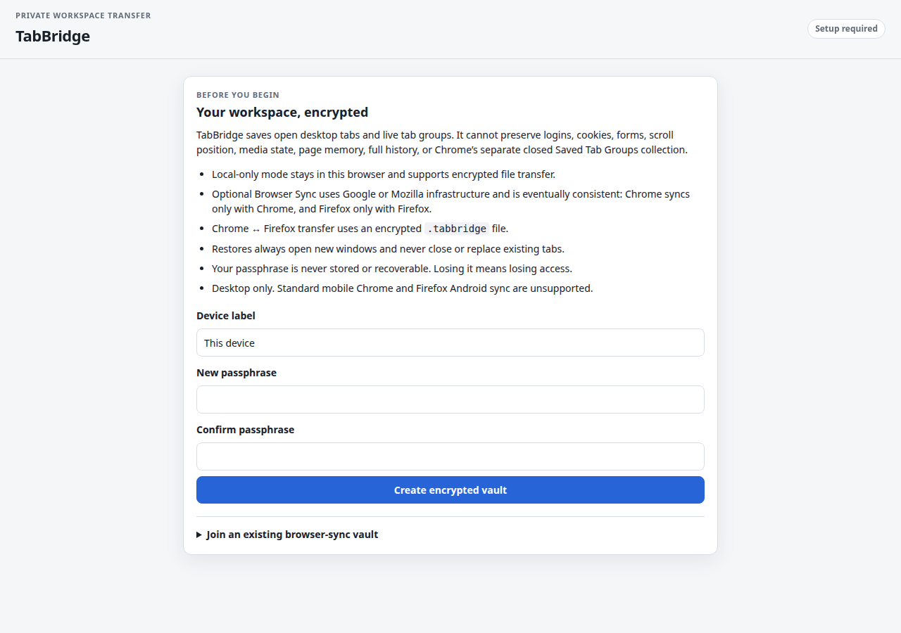
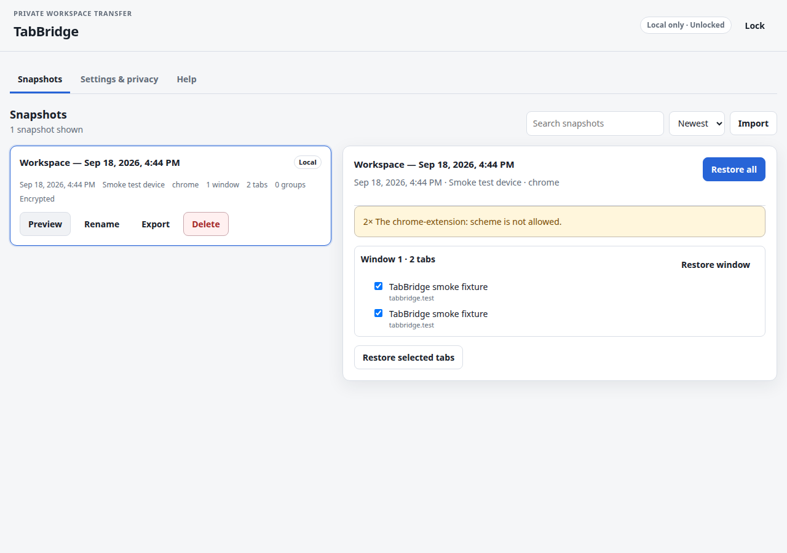
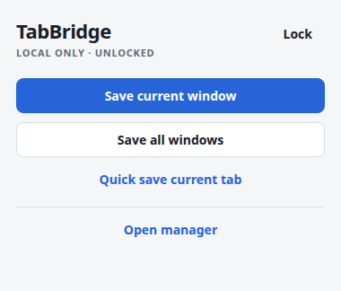

# TabBridge

[](LICENSE)

> Move your browsing workspace between devices—privately.

TabBridge is a desktop Chrome and Firefox extension for saving a reproducible snapshot of open tabs
and restoring a copy later. It preserves window boundaries, tab order, duplicate URLs, pinned and
active tabs, and currently open tab groups where the browser exposes them.

TabBridge has no developer-operated server, project account, telemetry, advertising, or runtime
network service. Snapshots are encrypted before storage. Optional browser-account sync uses Google
or Mozilla infrastructure; encrypted local files are the cross-browser transfer path.

## Release status

Version `0.1.0` is being prepared in this repository. No Chrome Web Store or Mozilla Add-ons listing
is claimed here, and an unsigned development build is not a production release. Treat a build as
releasable only after `npm run check`, the browser smoke tests in
[docs/RELEASING.md](docs/RELEASING.md), and signing or store review have completed with recorded
results.

## Screenshots

These images were captured from the built Chrome extension by the Playwright smoke workflow; they
are not mockups.



_First-run privacy disclosure and local vault setup._



_A saved workspace with an authenticated preview and per-tab restore controls._



_The compact popup after the local vault has been unlocked._

## What TabBridge saves

- The current normal window, all normal windows, or the current normal tab.
- Window separation and saved window order.
- Exact tab order, including duplicate URLs.
- Tab URL, title, pinned state, and the active tab in each window.
- Membership, title, color, order, and collapsed state for currently open tab groups.
- A user-supplied snapshot name, creation/update times, capture warnings, and a logical
  source-device label.

Incognito and Firefox private windows are excluded even if the browser is configured to let the
extension run there. Only valid `http:` and `https:` URLs are eligible. Unsupported or privileged
URLs are skipped and reported; TabBridge does not try to bypass browser restrictions.

TabBridge does **not** save cookies, passwords, browser history databases, page contents, form
values, login sessions, scroll position, media position, JavaScript memory, full navigation history,
or unsaved page state. A URL itself can contain a token or other secret, so snapshot encryption and
a strong passphrase still matter.

Chrome's separate collection of closed “Saved Tab Groups” is not exposed by the extension API.
TabBridge captures only groups that are currently open.

## Restore behavior

Restoration is copy-and-restore, never destructive movement:

- A restore requires an explicit user action.
- Content opens in new normal windows; existing windows and tabs are not replaced or closed.
- A received synced snapshot is never restored automatically.
- Whole-snapshot, window, group, and selected-tab restores are supported by the manager.
- Tabs are opened in saved order, pinned state is applied, groups are recreated when supported, and
  the saved active tab is selected last.
- Duplicate URLs remain duplicates.
- Individual failures do not require rolling back tabs that have already opened; the result report
  describes successes, skipped URLs, differences, and failures.
- A large restore requires confirmation and can stop opening remaining tabs.
- Background tabs can optionally be discarded after creation when the browser supports it.

Browser APIs cannot perfectly reproduce every state. If grouping and pinning conflict, TabBridge
prioritizes the pinned state and reports that the tab was left ungrouped. If group APIs are
unavailable, tabs are restored in contiguous saved order without groups and the fallback is
reported. Firefox can keep an active tab inside a collapsed group while Chrome may move the active
tab outside a fully collapsed group; a cross-browser restore reports the representational difference
when both saved properties cannot coexist.

## Transfer modes

### Local only

Encrypted snapshots live in extension `storage.local`. No browser account is needed and TabBridge
makes no network requests. An encrypted `.tabbridge` file can be exported for backup or moved
manually to another supported browser.

### Optional browser-account sync

Only snapshots explicitly selected for synchronization are copied to `storage.sync`. The extension
reports “Saved to browser sync” only after the local browser API accepts and verifies the write.
That does **not** prove another device has received it.

Browser sync is eventually consistent and may be delayed:

| Source  | Automatic destination | Requirement                                                                                             |
| ------- | --------------------- | ------------------------------------------------------------------------------------------------------- |
| Chrome  | Chrome                | Same Chrome extension identity and compatible Chrome Sync account/settings                              |
| Firefox | Firefox               | Gecko ID `{bf90e8ec-cdc7-4385-9bd9-19cac28c37c0}`, compatible Mozilla account, and Add-ons Sync enabled |
| Chrome  | Firefox               | Not supported by browser sync; use encrypted export/import                                              |
| Firefox | Chrome                | Not supported by browser sync; use encrypted export/import                                              |

Google and Mozilla sync are separate systems even when the account email addresses match. TabBridge
neither requests account identity nor knows which browser account is active. Best-effort Chromium
compatibility does not imply that another Chromium vendor supports extension-data sync.

### Firefox 140 and data consent

Firefox `140.0` or newer is required. Firefox exposed tab-group APIs earlier, but Firefox 140 is the
conservative minimum for its built-in extension data-consent flow. The Firefox manifest declares no
required data collection and makes these categories optional for Browser Sync:

- `browsingActivity` — encrypted records can represent visited tab URLs and tab structure.
- `websiteContent` — encrypted records can include page titles and user-named groups.
- `technicalAndInteraction` — encrypted records can include browser/device metadata and TabBridge
  settings needed to identify a source device.
- `personallyIdentifyingInfo` — user-controlled snapshot names and device labels can contain a
  person's name or other identifying text.

Firefox can surface optional technical/interaction consent during installation; the remaining
optional categories are requested from the user gesture that enables Browser Sync. TabBridge does
not write snapshot data to sync until sync is enabled and all needed consent is granted. Denying
consent leaves local-only storage and encrypted file transfer available. See Mozilla's
[built-in data-consent documentation](https://extensionworkshop.com/documentation/develop/firefox-builtin-data-consent/).

## Chrome ↔ Firefox encrypted transfer

1. In the source browser, open the manager and unlock the vault.
2. Choose a snapshot, select **Export**, and enter the export passphrase requested by the UI.
3. Move the resulting `.tabbridge` file by a method you trust.
4. In the destination browser, open the manager, select **Import**, choose the file, and enter the
   same export passphrase.
5. Review the authenticated import summary, including the skipped-URL count and whether it will be
   saved as a new copy, then confirm. No storage write occurs before confirmation.

The entire file is parsed, bounded, authenticated, decrypted, migrated, and schema-validated before
a snapshot is committed. Imported text is treated as hostile data and is never executed. A wrong
passphrase or modified ciphertext fails closed.

## Encryption and passphrases

Snapshot payloads use AES-256-GCM with a fresh random 96-bit IV. Vault and export keys are derived
with PBKDF2-HMAC-SHA-256, a fresh 128-bit salt, and 600,000 iterations. JSON is gzip-compressed
before encryption. Schema/encryption versions and logical record IDs are authenticated as additional
data.

Snapshot names, URLs, titles, group names, and device labels are inside the ciphertext. A small
unencrypted envelope remains so chunks can be assembled; it exposes format and cryptographic
parameters, logical UUIDs, encrypted length/chunk count, and commit/deletion timing.

TabBridge never uploads, syncs, logs, or persistently stores the passphrase. Derived key material
may be held in memory or trusted-context `storage.session` for the active browser session. **Lock**
clears that session material. JavaScript cannot guarantee physical memory erasure, and a compromised
unlocked browser profile is outside what client-side encryption can solve.

**There is no password recovery. A forgotten passphrase makes encrypted snapshots unreadable.** Keep
a secure record of it outside TabBridge.

Further details are in [the data-format specification](docs/DATA_FORMAT.md) and
[threat model](docs/THREAT_MODEL.md).

## Permissions

| Permission  | Why it is needed                                                                                                                   |
| ----------- | ---------------------------------------------------------------------------------------------------------------------------------- |
| `tabs`      | Read the URL, title, order, active state, and pinned state of normal tabs; create and update tabs during a user-requested restore. |
| `tabGroups` | Read currently open group metadata and recreate supported groups during restore.                                                   |
| `storage`   | Store encrypted snapshots, settings, session key material, and optionally browser-synchronized encrypted chunks.                   |

TabBridge requests no host permissions and uses no content scripts. It does not request `cookies`,
`history`, `identity`, `bookmarks`, `webRequest`, `scripting`, clipboard, downloads, or
native-messaging access. The Firefox data categories above are consent declarations, not additional
WebExtension API permissions.

## Platform limits

- Desktop Google Chrome 90+ and desktop Firefox 140+ are the intended targets.
- Standard mobile Chrome cannot install ordinary desktop extensions.
- Firefox for Android does not currently synchronize extension `storage.sync`; version 1 is
  desktop-only.
- Sync capacity is small (approximately 100 KiB, 8 KiB per item, and 512 items). TabBridge
  preflights conservative chunks and keeps an oversized snapshot local so it can be exported instead
  of truncated.
- Sync is not a backup or delivery-confirmation protocol. Keep encrypted exports of important
  workspaces.

## Development installation

There are no production-store links yet. Build locally from a reviewed checkout.

### Chrome (unpacked)

```sh
npm ci
npm run build:chrome
```

Open `chrome://extensions`, enable **Developer mode**, choose **Load unpacked**, and select
`dist/chrome`.

An unpacked extension ID can change if the manifest identity changes. For a repeatable development
identity, first create or upload the real unpublished Chrome Web Store item, copy its **public key**
from the dashboard, remove PEM headers/newlines as Chrome documents, place only that public value in
the Chrome source manifest's `key`, and verify the unpacked ID matches the dashboard item ID. No key
is fabricated before that item exists. Never commit a private `.pem`; the production identity comes
from the Chrome Web Store listing. See Chrome's official
[manifest key documentation](https://developer.chrome.com/docs/extensions/reference/manifest/key).

### Firefox (temporary)

```sh
npm ci
npm run build:firefox
npm run validate:firefox
```

In Firefox 140 or newer, open `about:debugging#/runtime/this-firefox`, choose **Load Temporary
Add-on**, and select `dist/firefox/manifest.json`. The Firefox build has the fixed Gecko ID
`{bf90e8ec-cdc7-4385-9bd9-19cac28c37c0}` so compatible installations address the same sync
namespace. Temporary installations disappear when Firefox restarts. Normal end-user installation
requires a Mozilla-signed package; this repository does not claim one has been published.

## Browser Sync setup

1. Create or unlock the local TabBridge vault.
2. Set a recognizable device label; it is snapshot metadata, not an account identifier.
3. Turn on **Browser Sync** in the manager. In Firefox, approve the optional data categories
   described above.
4. Mark only the snapshots you want synchronized.
5. Ensure Chrome Sync or Firefox Add-ons Sync is enabled in the browser itself.
6. On the other device, install the same production extension identity, unlock with the same vault
   passphrase, and wait for browser sync. Use the browser's sync controls if available.

Never interpret a local “Saved to browser sync” message as proof of remote delivery.

## Build and verification

Use the repository's pinned Node `24.21.0` from `.nvmrc` and an npm version allowed by
`package.json`.

```sh
npm ci
npm run format:check
npm run lint
npm run typecheck
npm test
npm run build
npm run validate:manifests
npm run validate:firefox
npm run package
npm run verify:packages
```

The aggregate gate is:

```sh
npm run check
```

Run the browser smoke test separately when it is not included in `check`:

```sh
npm run test:e2e
```

Do not infer success from these commands being documented—inspect their actual exit status and CI
record. Packaging is expected to produce:

- `dist/chrome/`
- `dist/firefox/`
- `artifacts/tabbridge-chrome-v0.1.0.zip`
- `artifacts/tabbridge-firefox-v0.1.0.zip`
- per-artifact SHA-256 files and `artifacts/SHA256SUMS`

The ZIPs are assembled with sorted paths and normalized metadata for reproducibility. See
[docs/RELEASING.md](docs/RELEASING.md) for artifact inspection, repeated-build comparison, manual
browser tests, signing, and publication.

## Project documentation

- [Architecture](docs/ARCHITECTURE.md)
- [Data format](docs/DATA_FORMAT.md)
- [Threat model](docs/THREAT_MODEL.md)
- [Release procedure](docs/RELEASING.md)
- [Privacy policy](PRIVACY.md)
- [Security policy](SECURITY.md)

## Contributing and security

Contributions are welcome under [CONTRIBUTING.md](CONTRIBUTING.md) and the
[Code of Conduct](CODE_OF_CONDUCT.md). Changes that add a permission, runtime network request,
remote asset, data category, dependency, or persistent plaintext field need explicit security and
privacy justification.

Do not file suspected vulnerabilities in a public issue. Follow [SECURITY.md](SECURITY.md) for
private reporting.

## License

Copyright © 2026 TabBridge contributors. TabBridge is available under the [MIT License](LICENSE).
Third-party development-tool notices are listed in [THIRD_PARTY_NOTICES.md](THIRD_PARTY_NOTICES.md).
